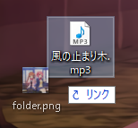
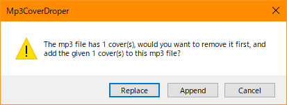
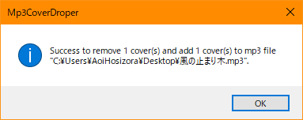

# Mp3CoverDroper

+ A windows shell extension that is used to update mp3's cover by dragging images and dropping to mp3 file.
+ Development environment: `.NET Framework 4.8` `Windows 10 20H2` `VS2019`.

### Dependencies

+ `SharpShell 2.7.2`
+ `ID3 0.6.0`

### Compile

+ If you are using VS Code and other command line tools such as `dotnet cli`:

```bash
# Mp3CoverDroper.Extension project
cd Mp3CoverDroper.Extension
rm bin/ obj/ -rf
dotnet msbuild -property:Configuration=Release -property:Platform=x64
# Mp3CoverDroper.Extension -> xxx\Mp3CoverDroper\Mp3CoverDroper.Extension\bin\x64\Release\Mp3CoverDroper.Extension.dll

# Mp3CoverDroper.Implementation project
cd Mp3CoverDroper.Implementation
rm bin/ obj/ -rf
dotnet msbuild -property:Configuration=Release -property:Platform=x64
# Mp3CoverDroper.Implementation -> xxx\Mp3CoverDroper\Mp3CoverDroper.Implementation\bin\x64\Release\Mp3CoverDroper.Implementation.exe
```

+ If you are using Visual Studio:

```bash
# You just need to open the sln file, build it in x64 platform with Release configuration.
```

### Register

+ Note that you need to add the following into PATH.
    + `sn.exe` `ildasm.exe` (Program Files\Microsoft SDKs\Windows\vx.xA\bin\NETFX x.x Tools)
    + `ilasm.exe` `regasm.exe` (Windows\Microsoft.NET\Framework64\vx.x.x)
+ Open cmd as administrator, and may need to restart explorer.exe.

```bash
Register.bat
# or execute the following commands

cd Mp3CoverDroper.Extension\bin\x64\Release
sn -k key.snk # generate key
ildasm Mp3CoverDroper.Extension.dll /OUTPUT=Mp3CoverDroper.Extension.il
ilasm Mp3CoverDroper.Extension.il /DLL /OUTPUT=Mp3CoverDroper.Extension.dll /KEY=key.snk # add key to dll
regasm /codebase Mp3CoverDroper.Extension.dll # register (note that before replace the dll, you need to unregister it)
```

+ Finally, setup registry for Mp3CoverDroper.Implementation.

```reg
; Use RegisterImpl.reg

; Note to replace to your Mp3CoverDroper.Implementation.exe path.
[HKEY_CURRENT_USER\SOFTWARE\AoiHosizora\Mp3CoverDroper]
"Implementation"="\"E:\\Projects\\Mp3CoverDroper\\Mp3CoverDroper.Implementation\\bin\\x64\\Release\\Mp3CoverDroper.Implementation.exe\""
```

### Unregister

+ Open cmd as administrator.

```bash
Unregister.bat
# or execute the following commands

cd Mp3CoverDroper.Extension\bin\x64\Release
regasm /u Mp3CoverDroper.Extension.dll # unregister
```

### Screenshots

||||
|---|---|---|

### References

+ [dwmkerr/sharpshell](https://github.com/dwmkerr/sharpshell)
+ [JeevanJames/Id3](https://github.com/JeevanJames/Id3)
+ [Shell Drop Handlers](http://www.codeproject.com/Articles/529515/NET-Shell-Extensions-Shell-Drop-Handlers)
+ [Install with regasm (using the GAC)](https://github.com/dwmkerr/sharpshell/blob/master/docs/installing/installing.md#install-using-the-gac)
+ [Are there limits in using more external libraries?](https://github.com/dwmkerr/sharpshell/issues/278)
