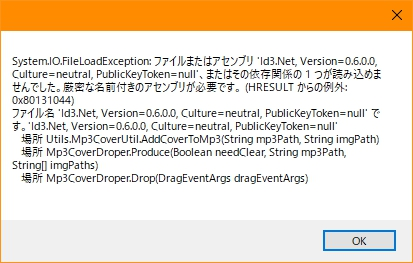
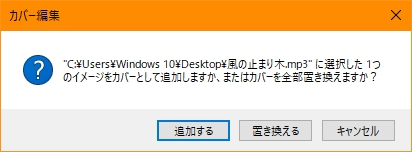

# Mp3CoverDroper

+ A windows shell extension
+ Personal tool to update mp3's cover by dragging and dropping files

### Environment

+ `.NET Core cli 2.2.401`
+ `.NET Framework 4.8`
+ `VS Code`
+ `Windows 10 Version 1803`

### Path

+ `Program Files\Microsoft SDKs\Windows\vx.xA\bin\NETFX x.x.x Tools` -> `sn.exe` / `ildasm.exe`
+ `Windows\Microsoft.NET\Framework64\vx.x.x` -> `ilasm.exe` / `regasm.exe`
+ ( `PATH` -> `Mp3CoverDroperApp.exe` )

### Dependencies

+ Service

```bash
dotnet add package SharpShell
```

+ App

```bash
dotnet add package ID3
dotnet add package System.Windows.Forms
dotnet add package System.Drawing.Common
```

### Install

+ Service (for drag and drop)

```bash
# register.bat

# Build service dll
cd services/
rm bin/ obj/ -rf

dotnet publish -c Release

# Generate Key
cd ./bin/Release/net48/
sn -k key.snk

# ReCompile
ildasm Mp3CoverDroper.dll /OUTPUT=Mp3CoverDroper.il
ilasm Mp3CoverDroper.il /DLL /OUTPUT=Mp3CoverDroper.dll /KEY=key.snk

# Backup dll
cp ./Mp3CoverDroper.dll ./../../../build/Mp3CoverDroper.dll
cp ./publish/SharpShell.dll ./../../../build/SharpShell.dll
cd ../../..

# Register
regasm /codebase ./build/Mp3CoverDroper.dll

cd ..
```

+ App (for main function and admin)

```bash
# build.bat

# Build Mp3CoverDroperApp.exe
rm app/bin/ app/obj/ -rf
dotnet publish app/ -c Release

# Move ./bin/Release/net48/Mp3CoverDroperApp.exe to PATH
# Or Modify DropHandlerService.cs app_path variable to the path of Mp3CoverDroperApp.exe
```

### Uninstall

```bash
# unregister.bat

regasm /u ./services/build/Mp3CoverDroper.dll

# Restart explorer.exe
```

### Problem

+ Nuget package `ID3` could not add to GAC directly -> couldn't use `ID3` directly in `SharpDropHandler`



### Screenshots

|||
|:---:|:---:|

### References

+ [Shell Drop Handlers](http://www.codeproject.com/Articles/529515/NET-Shell-Extensions-Shell-Drop-Handlers)
+ [Id3](https://github.com/JeevanJames/Id3)
+ [C#自定义MessageBox 按钮的Text](https://www.cnblogs.com/code1992/p/9719856.html)
+ [installing.md#install-using-the-gac](https://github.com/dwmkerr/sharpshell/blob/master/docs/installing/installing.md#install-using-the-gac)
+ [sharpshell-issue](https://github.com/dwmkerr/sharpshell/issues/278)
